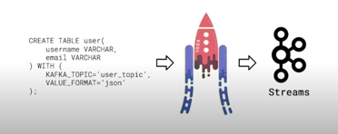

```shell
conda create -n streaming python=3.8 
```
# Kafka

Apache **Kafka**® is a `distributed streaming platform` that:

- Publishes and subscribes to streams of records, similar to a message queue or enterprise messaging system.
- Stores streams of records in a fault-tolerant durable way.
- Processes streams of records as they occur.

> **Kafka** is run as a cluster on one or more servers that can span multiple datacenters. The Kafka cluster stores streams of records in categories called `topics`. Each record consists of a `key`, a `value`, and a `timestamp`. - [Confluent](https://docs.confluent.io/5.5.1/kafka/introduction.html)


## Frequently used code for KAFKA
```shell
## TURN ON zookeeper -> server
/usr/local/kafka/bin/zookeeper-server-start.sh /usr/local/kafka/config/zookeeper.properties
/usr/local/kafka/bin/kafka-server-start.sh /usr/local/kafka/config/server.properties

$HOME = /usr/local/kafka/bin/
## show topic list
kafka-topics --list --zookeeper localhost:2181

## create the topic
$HOME/kafka-topics --create --bootstrap-server localhost:9092 --replication-factor 1 --partitions 1 --topic test
$HOME/kafka-topics.sh --create --bootstrap-server localhost:9092 --replication-factor 1 --partitions 1 --topic numtest

## show the topic
$HOME/kafka-console-consumer.sh --bootstrap-server localhost:9092 --from-beginning --topic numtest

## show the topic partiton 1
$HOME/kafka-console-consumer.sh --bootstrap-server localhost:9092 --from-beginning --partition 1 --topic numtest

## delete the topic
$HOME/kafka-topics --zookeeper localhost:2181 --delete --topic my_topic

## turn off the server -> zookeeper
$HOME/kafka-server-stop.sh config/server.properties
$HOME/zookeeper-server-stop.sh config/zookeeper.properties

## consumer groups check!
$HOME/kafka-consumer-groups.sh  --bootstrap-server localhost:9092 --list

## consumer status and offset check!
$HOME/kafka-consumer-groups.sh  --bootstrap-server localhost:9092 --group sr --describe

## consumer group delete
$HOME/kafka-consumer-groups.sh --zookeeper localhost:2181 --delete --group <group_name>

## topic leader follower check 
$HOME/kafka-topics.sh --zookeeper localhost:2181 --topic my_topic --describe

## server log check
cat /usr/local/bin/kafka/logs/server.log
```

## JDBC Sinks and Sources
  - Uses standard Java SQL interface (JDBC)
  - JDBC Sources are a common way to move data out of Kafka to traditional SQL data stores.
      - This is a common way of making stream processing insights available for more ad-hoc or batch querying.
  - JDBC Sinks are a common way to move data into Kafka from existing databases.

## Kafka Connector
### Kafka Connect Based on RestAPI
Kafka Connect assists creating and deleting connector by using RestAPI

- *GET /connectors* – list all connectors.
- *GET /connectors/{name}* – checking all the information of the {name} of connector.
- *POST /connectors* – create connector, body(data) must includes config information of connector in JSON Object type
- *GET /connectors/{name}/status* – check the current status of the connector if it’s `running` or `failed` or `paused`
- *DELETE /connectors/{name}* – delete {name} of connector
- *GET /connector-plugins –* check the installed plugs-in inside of Kafka Connector Cluster

### Connect Kafka Connect and Database
* check if JdbcSourceConnector was installed as plugin
```shell
curl http://localhost:8083/connectors | python -m json.tool
```
* use the REST API to check the connector status
```shell
curl <connect_url>/connectors/<your_connector_name>/status
# my connect_url was http://localhost:8083  
```

* use the REST API to check the task status for the connector.
```shell
curl http://localhost:8083/connectors/stations/tasks/<task_id>
```
## Faust
### Basic Faust app code
```python
import faust

class Greeting(faust.Record):
    from_name: str
    to_name: str

app = faust.App('hello-app', broker='kafka://localhost')
topic = app.topic('hello-topic', value_type=Greeting)

@app.agent(topic)
async def hello(greetings):
    async for greeting in greetings:
        print(f'Hello from {greeting.from_name} to {greeting.to_name}')

@app.timer(interval=1.0)
async def example_sender(app):
    await hello.send(
        value=Greeting(from_name='Faust', to_name='you'),
    )

if __name__ == '__main__':
    app.main()
```
#### execute
```shell
python faust_stream.py worker
```

## KSQL
```shell
ksql
```

### KSQL Commands
* Show topics displays all of the available topics on the broker
```sql
# KSQL CLI
SHOW TOPICS 
```

* streams can be created from a Kafka Topic or from a query
```sql
CREATE STREAM purchases(
		username VARCHAR, 
		currency VARCHAR, 
		amount INT
) WITH (
		KAFKA_TOPIC = "purchases", 
		VALUE_FORMAT = "JSON" # OR AVRO, DELIMITED (csv)
)

# or You may create a stream from another existing stream with
CREATE STREAM purchases_high_value AS # purchases_high_value is pre-existing stream
	SELECT * 
	FROM purchases
	WHERE amount > 100000; 
```

- **Kafka Streams** - A Java library for constructing stream processing applications. KSQL translates SQL statements to Kafka Streams applications
- check how we can use KSQL to build stream processing applications simply by writing SQL-like statements! In contrast to Faust, we are not actually going to build an application using a programming language like Python. Instead, KSQL will transform our SQL commands into running streaming processing applications for us !
- **KSQL transforms SQL queries into Kafka Streams applications.**
    - KSQL itself is a web server that accepts incoming HTTP REST calls to configure underlying Kafka Streams components to execute the stream process described in our SQL queries.
    - KSQL uses a Kafka topic as a changelog, and RocksDB to store local state on every node where KSQL is deployed.

