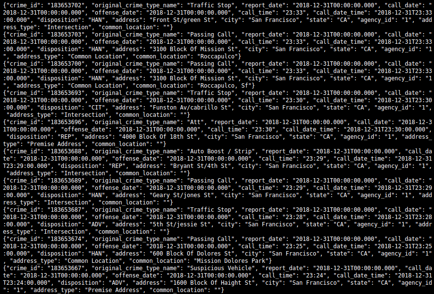
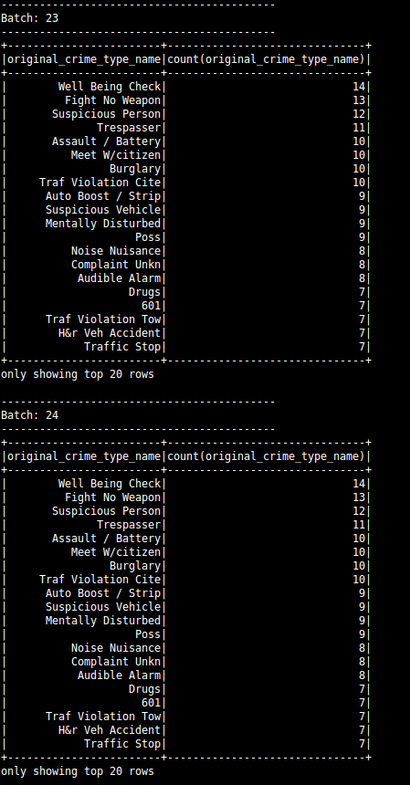
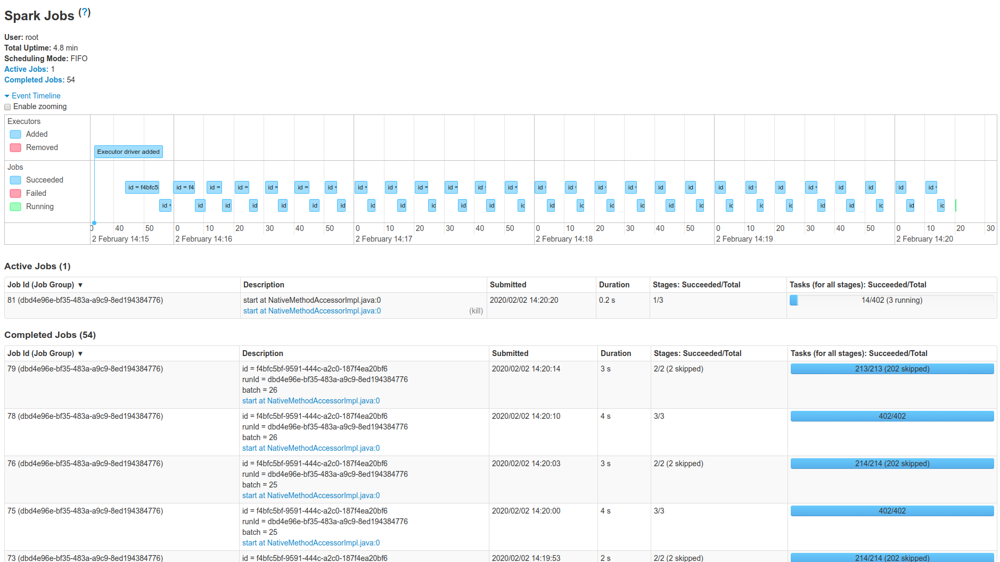

# SF Crime Statistics with Spark Streaming

## Overview

In this project, we provide a statistical analyses of the data using Apache Spark Structured Streaming. We created a Kafka server to produce data, a test Kafka Consumer to consume data and ingest data through Spark Structured Streaming. Then we applied Spark Streaming windowing and filtering to aggregate the data and extract count on hourly basis.

## Environment

- Java 1.8.x
- Python 3.6+
- Zookeeper
- Kafka
- Scala 2.11.x
- Spark 3.4.1

## How to Run?

### Start Zookeeper and Kafka Server

```bash
zookeeper-server-start.sh config/zookeeper.properties
kafka-server-start.sh config/server.properties
```

### Create Kafka Topic

```bash
kafka-topics.sh --create --topic com.sefidian.crime.police-event --zookeeper localhost:2181 --partitions 1 --replication-factor 1
```

### Run Kafka Producer server

```bash
python kafka_server.py
```

### Viewing messages

```bash
python kafka_consumer.py
```

or you can to use Kafka tool for that

```bash
kafka-console-consumer.sh --bootstrap-server localhost:29092 --topic com.sefidian.crime.police-event --from-beginning
```

### Submit Spark Streaming Job

```bash
 ./spark-submit --packages org.apache.spark:spark-sql-kafka-0-10_2.12:3.4.1 --master "local[2]" "/media/masoud/F60C689F0C685C9D/GIT_REPOS/Streaming/data_streaming/Spark/Project - SF Crime Statistics with Spark Streaming/data_stream.py"

```

## Screenshot Kafka Consumer Console Output



## Screenshot Data Stream Output



## Screenshot Spark UI


## Question 1

> How did changing values on the SparkSession property parameters affect the throughput and latency of the data?

- It had a clear impact on __<code>processedRowsPerSecond</code>__.

## Question 2

> What were the 2-3 most efficient SparkSession property key/value pairs? Through testing multiple variations on values, how can you tell these were the most optimal?

- Setting __<code>spark.sql.shuffle.partitions</code>__ to 2 vs. 20, showed that the <code>processedRowsPerSecond</code> was a lot better for 2.

- Setting __<code>spark.default.parallelism</code>__ to 100 vs. 10,000, showed that the <code>processedRowsPerSecond</code> was a lot better for 100.
